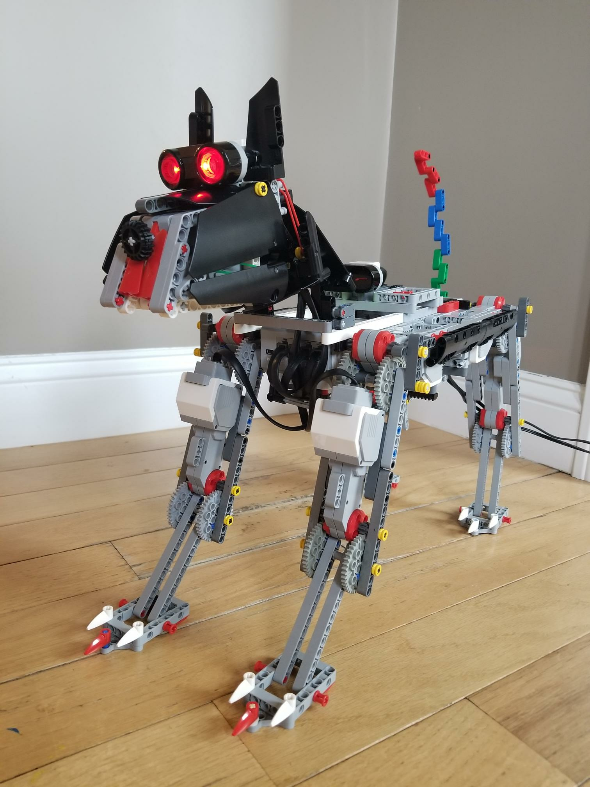

===================================
Software for self-made EV3 Robo Dog
===================================

This is a little fun project we did at home to build a 4-legged dog that can
properly walk. Our inspiration was Boston Dynamics Spot - what else?

We used two motors per leg, which means that we had to use two EV3 bricks to
dirve them.

We utilized the new pybricks-mircopython of ev3dev to implement the software.

